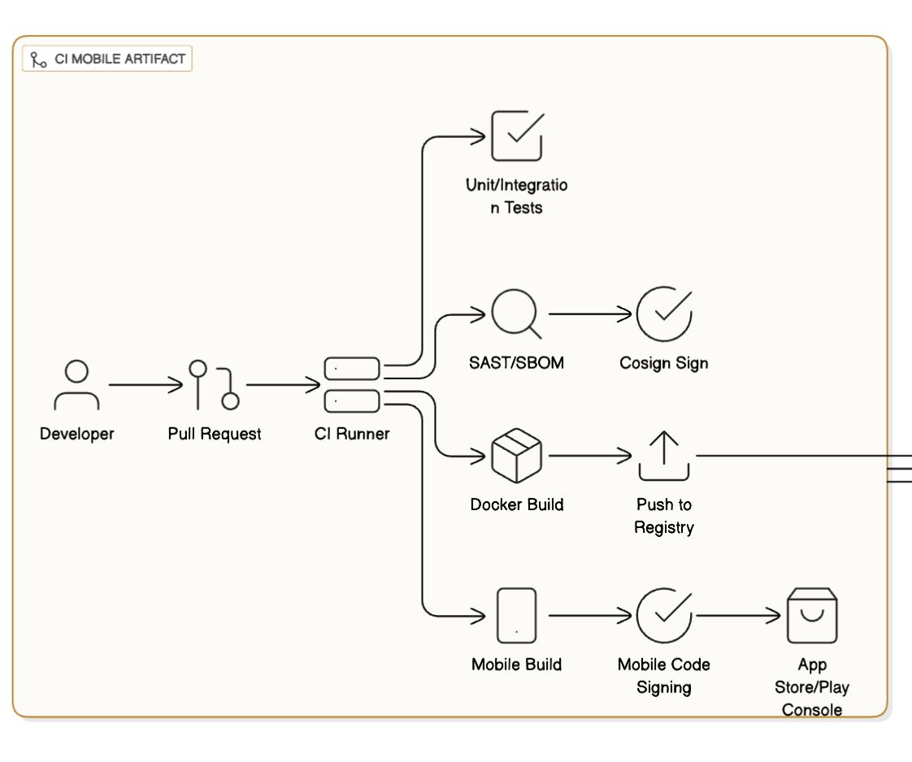

### CI SERVER



## 🧩 Folder Structure

Make sure your folder looks like this:

```
ciserver/
├── terraform/
│   ├── main.tf
│   ├── variables.tf
│   └── outputs.tf
├── ansible/
│   ├── inventory.ini
│   ├── jenkins.yml
│   └── README.md
├── README.md
└── .gitignore
```

---

## ⚙️ 1. Prerequisites

### On your local machine:

Install these tools:

```bash
sudo apt update -y
sudo apt install -y terraform ansible awscli
```

### Configure AWS credentials:

```bash
aws configure
```

Provide your:

- **AWS Access Key**
- **Secret Key**
- **Region** (example: `ap-south-1`)
- **Output format**: `json`

> You can verify with:

```bash
aws sts get-caller-identity
```

---

## 🚀 2. Terraform: Create EC2 Instance

Move into the Terraform directory:

```bash
cd ciserver/terraform
```

### Initialize Terraform:

```bash
terraform init
```

### Check Plan:

```bash
terraform plan -var="key_name=YOUR_KEY_PAIR_NAME"
```

> Replace `YOUR_KEY_PAIR_NAME` with your existing AWS EC2 key pair name (from AWS Console → EC2 → Key Pairs).

### Apply Configuration:

```bash
terraform apply -var="key_name=YOUR_KEY_PAIR_NAME" -auto-approve
```

✅ This will:

- Create a security group allowing SSH (22) and Jenkins (8080)
- Launch a `t2.micro` Ubuntu EC2 instance named **CI-server**
- Output the **public IP**

---

## 🔍 3. Get the EC2 Public IP

Once Terraform finishes, note the output like:

```
ci_public_ip = "13.233.xxx.xxx"
```

---

## 🗂️ 4. Update Ansible Inventory

Go to your Ansible directory:

```bash
cd ../ansible
```

Open `inventory.ini` and replace:

```
[ci_server]
REPLACE_WITH_IP ansible_user=ubuntu ansible_ssh_private_key_file=~/.ssh/YOUR_KEY.pem
```

Example:

```
[ci_server]
13.233.145.22 ansible_user=ubuntu ansible_ssh_private_key_file=~/.ssh/devops-key.pem
```

---

## 🧰 5. Run Ansible Playbook

Execute the Ansible playbook:

```bash
ansible-playbook -i inventory.ini jenkins.yml
```

### What this does:

- Updates and upgrades Ubuntu
- Installs Java (JDK 17)
- Installs Jenkins
- Enables and starts Jenkins service
- Adds the `ubuntu` user to the `jenkins` group
- Outputs initial admin password to:

  ```
  /home/ubuntu/jenkins_initial_admin_password.txt
  ```

---

## 🌐 6. Access Jenkins

Go to your browser:

```
http://<EC2_PUBLIC_IP>:8080
```

- Username: `admin`
- Password: Found in `/home/ubuntu/jenkins_initial_admin_password.txt`

Example:

```bash
ssh -i ~/.ssh/devops-key.pem ubuntu@<EC2_PUBLIC_IP>
sudo cat /home/ubuntu/jenkins_initial_admin_password.txt
```

Then login to Jenkins and finish the setup wizard.

---

## 🔐 7. Security Recommendations

1. **Change the admin password** immediately.
2. Restrict port 8080 to your IP in the Terraform security group.
3. Consider using HTTPS via Nginx reverse proxy.
4. Backup your Jenkins home directory:

   ```bash
   sudo tar czf jenkins_backup_$(date +%F).tar.gz /var/lib/jenkins
   ```

---

## 🧹 8. Cleanup (When done testing)

If you want to destroy the setup:

```bash
cd ../terraform
terraform destroy -var="key_name=YOUR_KEY_PAIR_NAME" -auto-approve
```

---

## ✅ Summary

| Step | Task                      | Command                                         |
| ---- | ------------------------- | ----------------------------------------------- |
| 1    | Configure AWS credentials | `aws configure`                                 |
| 2    | Terraform init & apply    | `terraform apply`                               |
| 3    | Update Ansible inventory  | edit `inventory.ini`                            |
| 4    | Run Jenkins playbook      | `ansible-playbook -i inventory.ini jenkins.yml` |
| 5    | Access Jenkins            | `http://<EC2_PUBLIC_IP>:8080`                   |

---
