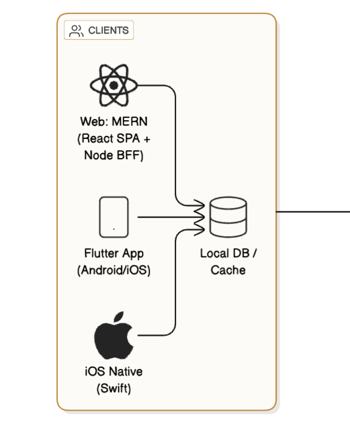

# 🧩 CLIENTS Layer Overview

This diagram represents the **CLIENTS** layer of the architecture.

It shows how different client applications interact with a **local database/cache** to provide a smooth, secure, and offline-capable user experience.

---

## 📘 What the Diagram Shows

The diagram includes three main components:

1. **Web: MERN (React SPA + Node BFF)**

   - The web application is built using the MERN stack (MongoDB, Express, React, Node.js).
   - It uses **React** for the Single Page Application (SPA) front end and a **Node.js Backend-for-Frontend (BFF)** layer to communicate with backend APIs securely.

2. **Flutter App (Android/iOS)**

   - A **cross-platform mobile app** developed using Flutter (Dart).
   - It runs on both Android and iOS, sharing a single codebase.
   - The app interacts with the **local DB/cache** to store and retrieve data when offline or to improve performance.

3. **iOS Native (Swift)**
   - A **native iOS application** built with Swift for Apple devices.
   - It directly communicates with the **local cache or database** for faster data access and synchronization with backend servers when online.

---

## 💾 Local DB / Cache

- All clients (Web, Flutter, and iOS Native) use a **local database or caching layer** to store session data, configurations, or temporary records.
- This ensures **offline access** and reduces backend load.
- Examples:
  - Web → IndexedDB or LocalStorage
  - Flutter → Hive / SQLite
  - iOS → CoreData or Realm

---

## 🔗 Data Flow Summary

- Each client app interacts first with its local DB/cache.
- Data is synchronized with backend APIs (through secure routes) whenever network access is available.
- This approach improves performance, reliability, and user experience.

---

## 🖼️ Diagram Reference

Below is the visual representation of this layer:



---

**In short:**

> This architecture layer represents how web and mobile applications connect locally before communicating with backend APIs — enabling faster, secure, and offline-capable user experiences.

```

---
```
